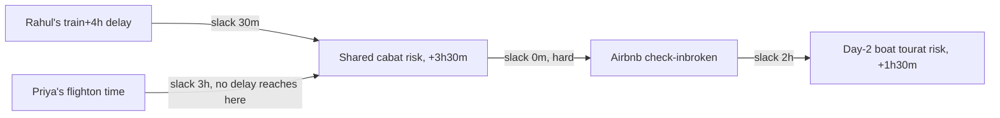
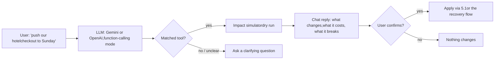

# YatraSarthi: feature addendum

Detailed design for six requested additions, on top of the existing solution and build guide: richer recovery ranking, multi-hop impact analysis, new disruption triggers, itinerary mutation, an AI chat layer, and four add-on integrations. Nothing here replaces the earlier docs — it extends the cascade engine, recovery ranker and data model already defined there.

## 1. Alternative recovery — at least 4 sortable plans

Requirement: generate ≥4 recovery plans, labelled by cost / speed / balanced, user can re-sort by preference

### Pipeline

1. **Candidate generation:** for the broken node, pull alternatives from the live inventory APIs (Section 6.4), plus a "wait it out" variant if the constraint is soft, plus one or more group-split variants when the node is shared.
2. **Feasibility filter:** unchanged from the solution doc — arrives before the next hard constraint, seats for the whole group, payable by the deadline.
3. **Minimum-option guarantee:** if fewer than 4 candidates survive filtering, broaden automatically — widen the search window (±1h, then ±3h), add one more transport mode, allow one more group-split configuration — and re-filter. If still under 4, show what exists and say why ("only 2 flights left today"), rather than padding the list with duplicates.
4. **Scoring:** normalise cost, arrival delay, and nodes-changed to 0–1 across the candidate pool, as before.
5. **Four headline plans** by weight preset:

| Plan | Cost weight | Time weight | Preserve weight |
| --- | --- | --- | --- |
| Cheapest | 0.7 | 0.15 | 0.15 |
| Fastest | 0.15 | 0.7 | 0.15 |
| Balanced *(new)* | 0.34 | 0.33 | 0.33 |
| Preserve itinerary | 0.15 | 0.15 | 0.7 |

**De-duplication:** with a small candidate pool, two presets can pick the same top candidate. When that happens, the lower-priority preset takes its next-best *distinct* candidate instead, so the user always sees four genuinely different plans, not one plan under four labels.

### Free sorting

Below the four headline cards, the full filtered candidate list is shown as a plain sortable table — sort by cost, arrival time, or nodes changed, ascending or descending. This is the generic "sort by preference" control, independent of the four presets above.

### Screen

Extends **E3 (Recovery options)** from the UI plan: four cards up top, sortable table beneath, same "Compare on a chart" Pareto link as before.

## 2. Impact of disruption on further nodes

Requirement: a delay must be shown propagating past the immediate next node, not just one hop

The cascade engine's `propagateDelay` (Build Guide, Section 2) already walks the *entire* topological order forward from the broken node, so multi-hop propagation is already computed — this section is about making sure the UI actually shows the whole chain, not just the first hop, and that shared nodes merge correctly across a group.



- **Merge rule:** a shared node (the cab, above) takes the *maximum* incoming delay across every path feeding it — Priya's on-time flight contributes nothing, Rahul's train contributes the full remaining delay after its own slack.
- **Chain rendering:** the Cascade impact screen (**E2**) renders every affected node as a connected path, each with its own running delay and hard/soft status, instead of a flat list of "affected nodes" with no ordering.
- **Stopping point:** propagation naturally stops once a node's incoming delay is fully absorbed by its slack (D above, if its buffer were large enough) — nothing further downstream needs to be shown as affected.

## 3. New disruption triggers

Requirement: cancellations, weather, and the traveller voluntarily changing plans, not just delays

### 3.1 Cancellation

A cancellation is not a large delay — it's a different kind of break. Add `status: "cancelled"` alongside the existing on_track / at_risk / broken / confirmed values. A cancelled node:

- Forces every downstream edge to `hard`-broken regardless of buffer size — there's no partial wait, the leg simply won't happen.
- Sends the recovery ranker down the "find a wholly new booking" path rather than the "push the existing one" path used for delays — the candidate generator queries inventory for a replacement, not a rescheduled version of the same booking.
- Tags `triggerSource: "vendor_cancellation"` on the action, which the DGCA policy engine treats as the last-minute-cancellation rule, not the delay rule (Section 8 of the solution doc).

### 3.2 Weather

- New provider adapter (weather, e.g. OpenWeatherMap or Tomorrow.io) polled by the same windowed scheduler as the road-ETA provider, scoped to each node's airport or route.
- A weather flag doesn't hard-break anything by itself — it raises the node's miss probability in the health score (Section 9 of the solution doc) and shows a proactive advisory ("Heavy rain forecast at BOM, 40% of flights delayed on this route historically in monsoon") ahead of any official delay or cancellation.
- When a real disruption does follow, `triggerSource: "weather"` sets the DGCA extraordinary-circumstances flag automatically, so cheapest-mode never nets in compensation that a weather-caused delay wouldn't actually qualify for.

### 3.3 Traveller-initiated change

Not a disruption — the user just wants something different. This is a **what-if** request, not an alert: no push notification, no urgency framing, and it runs through a *dry run* of the same cascade engine before anything commits.

- Entry point: a "What if…?" action on any node in the timeline, or the AI chat (Section 5.2).
- The user states a hypothetical (move this to tomorrow, drop this stop, add a day here) and sees the full downstream impact — cost, broken/at-risk nodes, group effects — before deciding whether to actually apply it.
- If they proceed, it becomes a normal itinerary mutation (Section 5.1), logged the same way a recovery-plan application is, just without a disruption behind it.

## 4. Downstream impact analysis — the impact simulator

Requirement: a way to see the full downstream effect of a change, on demand

A single stateless service wraps `TripGraph.propagateDelay` in a mode that computes without saving:

```
POST /api/trips/:id/impact-simulate
body: { nodeId, change: { type: "delay", minutes: 240 } | { type: "cancelled" } }
returns: { broken: Node[], atRisk: Node[], estimatedCost, affectedMembers: string[] }
```

- Called automatically the moment a real disruption is detected or reported (feeds the Cascade impact screen, **E2**).
- Called manually from the new "What if…?" action (Section 3.3) or from the AI chat (Section 5.2) — same endpoint, same output shape, nothing persisted until the user explicitly applies it.
- This is also what powers the health score's per-edge risk numbers pre-trip — the simulator run at a range of hypothetical delays is exactly how "a 1-in-4 chance this gets tight" gets computed.

## 5. Updating the itinerary

### 5.1 Applying a recovery plan

Once an action reaches `confirmed` (Build Guide, Section 6), a mutation step rewrites the affected node's time, vendor reference and cost in place, and recomputes the edges around it. The pre-change values stay in the append-only `events` log, so refund and compensation math (Section 8 of the solution doc) always has the original plan to compare against, even though the itinerary the user now sees is the new one.

```
POST /api/itinerary/apply-plan
body: { tripId, actionId, chosenPlanId }
effect: nodes/edges updated, event logged with { before, after }, realtime broadcast to the trip channel
```

### 5.2 AI chat for customization

The chat is a natural-language front end to the same deterministic functions everywhere else uses — it never edits the database directly. This keeps the "explainable, not a black box" principle from the original solution doc intact even with a conversational layer on top.



- **Fixed toolset only:** `moveNode`, `addPhantomNode`, `removeNode`, `requestAlternatives`, `simulateChange`. The model picks one and fills its JSON-schema arguments — both Gemini and OpenAI support this natively, so it's the same pluggable `packages/llm` adapter from the build guide, one capability added.
- **Simulate before applying, always:** every tool call runs through the impact simulator first; the chat's reply is built from that real result, not generated freely, so it can't describe an effect that isn't actually true.
- **Explicit confirm, not chat text:** "yes" in the chat isn't enough to mutate anything — a separate confirm action is required, the same guard as everywhere else destructive actions happen in the app.
- **Safe failure:** a request that doesn't map cleanly to a tool becomes a clarifying question, never a best-guess mutation.

### Screen

New chat panel, opened from a persistent icon on the trip timeline (**D1**); shares the "What if…?" simulator output styling from Section 3.3 so a chat-proposed change and a manually-triggered one look identical before confirmation.

## 6. Add-ons

### 6.1 Group trip

Already fully specified as the Kutumb engine — multi-origin mapping (**B3**, **D3**), weakest-link resolution, split pay. No new design needed; the additions above extend it directly: the 4-plan ranker splits cost per member on every plan, and the impact simulator's `affectedMembers` field is what drives the group overview's weakest-link callout.

### 6.2 SOS button

Already fully specified as Suraksha (**H1–H4**). One small extension worth adding: if a weather flag (Section 3.2) is active on the user's current node when SOS fires, include it in the outgoing message — "heavy rain reported in the area" is useful context for whoever receives the alert.

### 6.3 Mapbox for phantom-node distance and time

The build guide's road-ETA slot is filled with the **Mapbox Directions API** (traffic-aware driving profile), returning duration and distance for a given origin/destination pair — this is the live estimate shown when a phantom node (**C5**) is created, and what the windowed scheduler re-polls before departure.

One thing worth knowing going in: Mapbox's traffic data has historically been thinner in dense Indian cities than Google's or HERE's, which was the reason the earlier solution doc suggested Mapbox as a fallback rather than the default. Since Mapbox is the explicit choice here, the existing user-editable buffer (Section 3 of the solution doc) is what absorbs that gap — it was already designed for exactly this kind of estimate uncertainty, so no extra mitigation is needed beyond keeping that control easy to find. If accuracy turns out to be a real problem in testing, the road-ETA slot is already behind an adapter interface, so swapping providers later doesn't touch anything else.

If a future feature needs many-to-many travel times at once (ranking several candidate pickup points, say), the **Mapbox Matrix API** is the equivalent extension — not needed for anything currently in scope.

### 6.4 Real-time flight and train data

| Mode | Recommended for MVP | Upgrade path | Caveat |
| --- | --- | --- | --- |
| Flight | **AeroDataBox** or **Aviationstack** — cheap entry tier, straightforward REST, adequate coverage of Indian carriers for status and schedule data | **FlightAware AeroAPI** — predictive ETAs and a stronger tracking network once volume or accuracy needs grow | Amadeus's self-service portal is gone (per the solution doc); none of these need it. |
| Train | An unofficial IRCTC-status API (the RapidAPI-style marketplace listings), combined with user-reported "running late" as the primary signal | A direct partnership with an existing provider (ixigo, RailYatri, Where Is My Train) if volume ever justifies it | There is no official public IRCTC API. Any unofficial one carries ToS risk and patchy reliability — this is exactly why the solution doc labels train detection "best-effort, medium trust" rather than treating it like flight data. |
| Weather (for 3.2) | OpenWeatherMap or Tomorrow.io | — | Used for risk flags and the extraordinary-circumstances tag, not for anything safety-critical. |

## 7. Where this lands in the 5-person split

| Addition | Owner |
| --- | --- |
| 4-plan ranker, sortable list | Person 4 — Recovery, Payments & Vendor Execution |
| Multi-hop cascade rendering, impact simulator | Person 3 — Graph, Health & Cascade |
| Cancellation status, weather adapter | Person 3, with the weather adapter's DGCA tagging shared with Person 4 |
| Itinerary mutation on plan apply | Person 4 |
| AI chat assistant | New shared surface — built on Person 2's `packages/llm` adapters, but the tool functions it calls belong to whichever person owns that mutation (Person 3 for graph edits, Person 4 for recovery/payments) |
| Mapbox integration | Person 3 (phantom nodes live on the graph/health slice) |
| Flight/train API adapters | Person 3 |