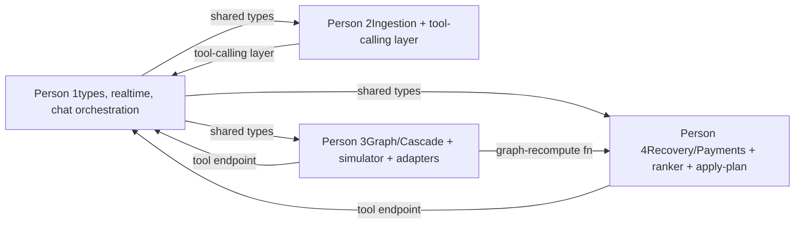

# YatraSarthi: 4-person addendum split

Same feature addendum, four people instead of five — done by merging the two originally lightest roles into one person, so the three heavier specialist roles, and everything already built or in progress under them, stay exactly as they were.

## 1. The merge

| Original 5-person role | Now |
| --- | --- |
| Person 1 — Trip Core & Access | **Person 1** — Trip Core, Access, Suraksha, Settings & Realtime |
| Person 5 — Suraksha, Settings & Realtime |  |
| Person 2 — Ingestion | **Person 2** — unchanged |
| Person 3 — Graph, Health & Cascade | **Person 3** — unchanged |
| Person 4 — Recovery, Payments & Vendor Execution | **Person 4** — unchanged |

These two were the merge candidate because they were already the two lightest slices, in screen count and in the difficulty ranking done earlier. Merging two light roles keeps the three heaviest, most algorithm-dense roles undisturbed — anyone already deep in the graph engine, the ranker, or ingestion keeps their exact ownership boundary; nothing they've built needs to move.

Honest trade-off: this isn't free. Person 1 now covers what were two people's early-phase foundations — the realtime utility and the shared types *and* trip core and auth — so their own work is more sequential than parallel. Expect this split to run a bit longer end-to-end than the 5-person version, concentrated entirely in Person 1's queue, not spread across the team.

## 2. Person 1 — Trip Core, Access, Suraksha, Settings & Realtime

### Owns (unchanged from the original split)

Screens A1–4, B1–4, H1–4, I1–5. Collections: `users`, `trips`, `events`. The Ably/Pusher realtime utility. Twilio Verify auth. `packages/types`. Routes: `POST /api/trips`, `POST /api/trips/:id/join`, `POST /api/suraksha/trigger`.

### New, from the addendum

- Extend `packages/types` with `status: "cancelled"`, a `triggerSource` field, and the chat message/session shape.
- Build the **AI chat panel and orchestration**: message history, sends text to Person 2's tool-calling layer, routes the matched tool call to Person 3 (graph edits) or Person 4 (`requestAlternatives`), streams the reply over the realtime channel, and requires an explicit confirm tap before anything commits.
- Add the weather-risk flag to the Suraksha payload when active.

### Suggested internal order

Ship the realtime utility and the type additions first — both block other people. Trip core and auth next. The chat panel last, once Person 2's tool-calling layer and Person 3/4's tool endpoints exist to call into. Suraksha and settings screens can be wired any time in between; they don't block anyone.

## 3. Person 2 — Ingestion

### Owns (unchanged)

Screens C1–6. `nodes` collection. `packages/llm` (extractor adapters). Routes: `POST /api/ingest/upload`, `POST /api/whatsapp/webhook`, `POST /api/nodes/:id/confirm`, `POST /api/nodes/phantom`.

### New, from the addendum

- Extend `ExtractorProvider` with a tool-calling mode: message in, one of the five fixed tools (or a clarifying question) out, schema-validated.
- Extend booking extraction to classify cancellation vs. delay, tagging `triggerSource: "vendor_cancellation"`.
- Add the cancelled-status treatment to booking detail (**C6**).

## 4. Person 3 — Graph, Health & Cascade

### Owns (unchanged)

Screens D1–4, E1–2. `edges` collection. `packages/graph`. Route: `GET /api/trips/:id/graph`, `POST /api/disruptions/report`.

### New, from the addendum — the heaviest addition in this split

- Build the impact simulator (`POST /api/trips/:id/impact-simulate`) as a dry-run wrapper around `propagateDelay`.
- Add cancelled-node handling: forces every downstream edge hard-broken regardless of buffer.
- Build the weather, Mapbox, and flight/train real-time adapters.
- Extend the cascade impact screen (**E2**) for the full multi-hop chain, and add the "What if…?" action on nodes (**D2**).
- Expose the graph-recompute function Person 4 calls after a recovery plan changes a node.

## 5. Person 4 — Recovery, Payments & Vendor Execution

### Owns (unchanged)

Screens E3–5, F1–3, G1–4. `actions` and `payments` collections. Routes: `GET /api/trips/:id/recovery-options`, `POST /api/actions/:id/propose`, `POST /api/actions/:id/confirm`, `POST /api/payments/create-links`, `POST /api/payments/webhook`.

### New, from the addendum

- Extend the ranker to four labelled, de-duplicated plans plus the minimum-option-guarantee broadening step, and the sortable candidate list on a redesigned **E3**.
- Build `POST /api/itinerary/apply-plan`, calling Person 3's graph-recompute function on confirm.
- Wire `triggerSource: "vendor_cancellation"` and `"weather"` into the DGCA policy engine.
- Expose the tool endpoint the chat calls for `requestAlternatives`.

## 6. Dependency map

## 7. Rough order

| When | What's happening |
| --- | --- |
| Day 0 | Contract sync, all four together |
| Days 1–2 | Person 1 ships shared types and the realtime utility (both block others); Person 2 starts ingestion + tool-calling layer; Person 3 starts the impact simulator (pure logic, no dependency); Person 4 starts the ranker extension |
| Days 2–4 | Person 1 moves to trip core and auth; Person 3 builds cancelled handling and the weather/Mapbox/flight/train adapters in parallel; Person 4 builds `apply-plan` against Person 3's graph-recompute function once it's ready |
| Days 4–6 | Person 1 builds the chat panel once Person 2's tool-calling layer and Person 3/4's tool endpoints exist; Person 3 finishes the adapters; Person 4 finishes DGCA wiring |
| Days 6–8 | Person 1 wires Suraksha/settings screens and the weather flag; full-team integration |
| Days 8–9 | Buffer — this is the day the 5-person version didn't need, and it lands entirely on Person 1's queue, not the team's |